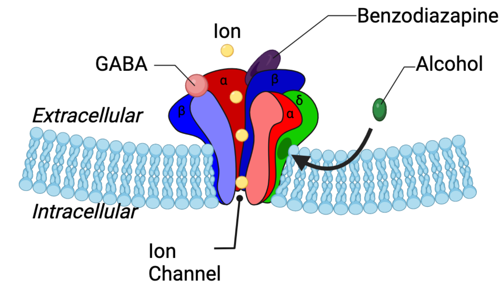

## Overview

- The Biology and Genetics of Alcoholism 

Note:  I use "Alcoholism" because it is a shorthand.  Some people prefer the term Alcohol Use Disorder.  This is not meant to imply or reinforce any stigma.

  - Some basic definitions
		(Biology 101 condensed into 5-10 minutes)

  - Genetic "Causes" of Alcoholism

  - Effects

- Simplified Overview

## Some basic definitions...

A really short course in biology taught by someone with no business teaching a longer course.

## Genes and the genome

***The Genome***

- The whole DNA that you need to create an organism.
- Imagine a book written on a long string of beads (DNA is double stranded)
- Individual beads (letters of the book) are called nucleotides or bases.  For a human you need about 3.2 billion letters.
- Names of the bases start with letters, ACTG.

## Gene:

* A part of the genome (call it a page from the book or a chapter) that contains the code for "a single protein (or proteins)."
* Some parts of the gene say how to build a protein, other parts control how much protein gets created (regulation).
* Other parts do nothing, are leftovers from evolution, or are not yet understood.

## More definitions

***Central Dogma of Biology:***

$\boxed{ \text{DNA (the genome)}} \rightarrow \boxed{\text{Expression:  RNA} \rightarrow \text{ Proteins}}$

- DNA almost everywhere.
- What gets expressed changes depending on:
  - cell type
  - stage of development
  - environment (e.g. stress, chemicals ingested)

## How this looks ("sequenced DNA")

The Human Genome Project was an attempt to translate this string of biochemical "nucleotides" (all 3.2 billion) into letters representing each one. "Completed" in 2000-2003.

How it looks (for part of one gene):

> >NP_000798.2 {"type": "CDS", "gene": "GABRA2", "product": "gamma-aminobutyric acid receptor subunit alpha-2 isoform a precursor", ...}
ATGAAGACAAAATTGAACATCTACAACATGCAGTTCCTGCTTTTTGTTTTCTTGGTGTGG
GACCCTGCCAGGTTGGTGCTGGCTAACATCCAAGAAGATGAGGCTAAAAATAACATTACC
... + 485 more lines !

## Causes:  Genetics of Alcoholism

It's estimated that genetics accounts for some 50-60% of the risk of developing alcoholism, with 40-50% of risk coming from environment: "childhood trauma, chronic stress, peer groups, and early exposure to drinking."

***IMPORTANT:  We are not talking about a single alcohol gene here.***

Alcoholism is **Polygenic** (Caused by many genes).  Most traits and diseases are polygenic.

## Other Examples
* Polygenic traits and diseases:  Heart disease, Height, Type 2 Diabetes, Impulsivity, High Blood Pressure, Schizophrenia, Bipolar Disorder etc. etc.  Most genetic conditions/traits are like this.
* Some monogenic diseases:  Sickle Cell Disease, Tay Sachs, Cystic Fibrosis.
* In the case of alcoholism, about 100 or more different genes affect your level of susceptibility.  (As of now -- we may learn more)

## Genes Involved In Alcoholism (Part I)

* Variations in genes that relate to how the body metabolizes alcohol.  Two variations (more common in Asian populations) cause either an unpleasant flushing response or people get extremely ill.  
* This happens because alcohol metabolism is a two-part process.  First, a toxic byproduct is created, then in the second phase, it is broken down.  People with this variation have lost function in the second phase, so the result is that their body naturally functions like they've taken antabuse.  These genes are considered *protective*.

## Alcohol Metabolism (Continued)

* A sort of opposite problem from the alcohol flush reaction is people who are highly tolerant of alcohol. They can at first drink quite a bit without getting sick.  We say they have a "low level of response" or "low subjective response", and this is considered to strongly predispose an individual to alcoholism.

## Genes Involved In Alcoholism (Part II)

* Variations in genes that control "impulsivity".  Impulsivity is itself
regulated by several genes in interaction with the environment.  People who are
more impulsive are inclined to take more risks early in life -- to drink and
to drink more than others.  Early drinking in turn itself is a risk factor.
* Variations in a gene that relates to how strongly we react to bitter tastes.
* My personal favorite gene is GABRA2, which encodes one of the parts (the $\alpha$ subunits) of the GABA receptor.

## Gabbing about GABA....

&nbsp;

## GABA and GABA Receptors

* We're not biochemists, but what the heck:  GABA stands for $\gamma$ (Gamma) Aminobutyric Acid.
* For our purposes what's important is that it's a neurotransmitter, naturally occurring in our brains, that:
  * Inhibits nerve cells (makes it less likely that they'll fire).
  * Because of this, has a calming effect (anti-anxiety or "anxiolytic") effect.
* It has the opposite effect of glutamate, an "excitatory" neurotransmitter, which makes it **more** likely for a neuron to fire.

## GABA Receptors

* Live primarily in the cell membrane of nerve cells.
* Are composed of different subunits.
* Slow-acting subunits were important in human evolution, and in drugs that treat alcoholism.  (Note that this is a whole different system than the fast-acting ($\alpha$) subunit), so it's not involved in the answer to why people develop alcoholism.
* Variation in the fast-acting ($\alpha$) subunit puts you at greater risk of alcoholism.

## One Picture ***Plus*** One Thousand words

## Variations in GABA Receptor Genes

* Generally for all of this discussion, we're talking about variations in regulatory regions of genes -- i.e., how many receptor components are produced and at which stage of development.
* Variations in the genes for both fast-acting and slow-acting GABA receptors have been linked to Developmental and Epileptic Encephalopathy (DEE). This is a condition where epileptic seizures that often begin in infancy lead to developmental disorders (and increased mortality risk).

## Variations in GABA Receptor Genes (Continued)

* Variations in the GABBR2 gene (for the slow-acting GABA-B receptors)  were important in human evolution.  A new variation (allele) that already existed spread rapidly through the population in the last 10,000-100,000 years.  This may have helped prevent tumors.  It also likely helped protect against having too much glutamate in the system as the neocortex expanded, which would have led to fatal seizures. Again -- this is a *different* system than the fast-acting ($\alpha$) subunit involved in the development of alcoholism.

## Variations in GABA Receptor Genes (Page 3)

* Variations in the GABRA2 gene (for the fast-acting GABA-A receptors) increase the risk for alcoholism.
  * When alcohol binds to a GABA-A receptor, the receptor will stay open longer, letting more $\text{Cl}^-$ (chloride) ions pass through.  This makes the overall charge slightly more negative, which prevents the nerve cell from firing. (Inhibition).
  * It's not that there's more GABA in the brain (from this mechanism, at least), it's that what is there is now effectively supercharged.

## GABA in the Midbrain During Binge Drinking

Binge drinking (in everybody) causes GABA to be "co-released" when dopamine is released in the midbrain.  In this case, dopamine acts as a motivator to start or continue drinking, and the GABA co-release acts as GABA always does, to inhibit a response.  However, variations in one of the enzymes involved in alcohol metabolism in the liver also regulate how much GABA is produced in the midbrain, which is also producing dopamine. For people with this variation, the dopamine is saying "keep drinking", and because there's less GABA being co-released the brakes in the system have failed.

## Effects (How the Body Responds)

(Not completed)
